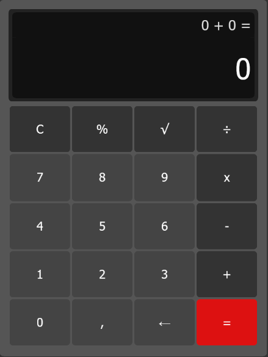
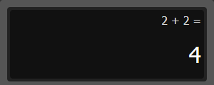
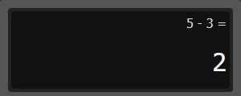
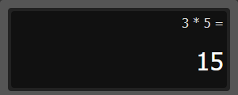
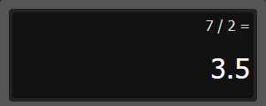
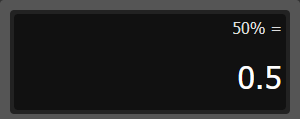
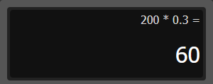

# 🧮 Calculadora 🧮

[](https://developer.mozilla.org/en-US/docs/Web/JavaScript)
[](https://opensource.org/licenses/MIT)

## Sobre

Projeto replicando a calculadora do Windows 10 e algumas de suas funções 

## Instalação

- Clone o projeto no terminal com o [git](https://git-scm.com/) ou baixe em [.zip](https://github.com/julianebueno/Calculadora/archive/refs/heads/main.zip) e descompacte. 

``` js
git clone https://github.com/julianebueno/Calculadora.git
```

- Execute o index.html

## Imagens

<div>
  
</div>

---

<table>
  <tr align='center'>
    <td>Soma</td>
    <td>Subtração</td>
  </tr>
  <tr>
    <td width='50%'>
      
    </td>
    <td>
      
    </td>
  </tr>

  <tr align='center'>
    <td>Multiplicação</td>
    <td>Divisão</td>
  </tr>
  <tr>
    <td width='50%'>
      
    </td>
    <td>
      
    </td>
  </tr>

  <tr align='center'>
    <td>Porcentagem 1</td>
    <td>Porcentagem 2</td>
  </tr>
  <tr>
    <td width='50%'>
      
    </td>
    <td>
      
    </td>
  </tr>
</table>


---
Feito por Juliane Bueno
